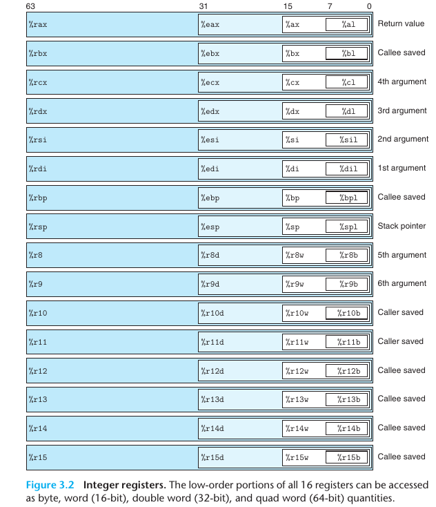

# Chap03

- [Chap03](#chap03)
  - [Contents](#contents)
    - [Notes](#notes)
      - [Registers](#registers)
      - [Operand Specifier](#operand-specifier)
      - [Move Instructions](#move-instructions)
        - [Pushing and Popping Stack Data](#pushing-and-popping-stack-data)
      - [Arithmetic and Logical Operations](#arithmetic-and-logical-operations)
        - [Load effective address](#load-effective-address)
        - [Unary and Binary Operations](#unary-and-binary-operations)
    - [Homework](#homework)

## Contents

This chapter builds around the assemble language, with a subset of x86-64 ISA, y86-64.

For the source code from CS:APP website are too old to build(wasted a lot of time..), I turn to online simulators. Here are the url: [y86.js.org](http://y86.js.org/), [boginw.github.io/js-y86-64/](https://boginw.github.io/js-y86-64/).

Before the homework, there will be some notes about the basic knowledge.

### Notes

#### Registers



#### Operand Specifier

Instruction set should have access to data stored in registers and memeory, and `Operand` is used to get them to a specific zone for possible use from some instructions.  

Immediate: `$Imm`, you will get the value Imm
Register: `%r`, here %r is a register's name, you will get data stored in `%r`
Memory: find data in memory 
1. `Imm`: data with value of Imm
2. `(%r)`: data at value in reg %r
3. `Imm(%r)`: data at (Imm + %r)
4. `(%ra, %rb)`: data at (%ra + %rb)
5. `Imm(%ra, %rb)`: data at (Imm + %ra + %rb)
6. `(, %r, s)`: data at (s*%r), where s is short for scale
7. `Imm(, %r, s)`: data at (s*%r + Imm)
8. `(%ra, %rb, s)`: data at (%ra + s*%rb)
9. `Imm(%ra, %rb, s)`: data at (Imm + %ra + s*%rb)


#### Move Instructions

`mov_ S D`: _ could be `b`, `w`, `l`, `q`  for different size. There are at least 1 reg in S, D.
`movabsq`
`movz__ S R`: Do zero extension and move.
`movs__ S R`: Do sign extension and move.

##### Pushing and Popping Stack Data
These operations are aiming at push and pop data into or from stack register `%rsp`.

`pushq S`: push a 64-bit data into **memory** at R[%rsp] and the R[%rsp] decreases by 8.
`popq D`: pop a 64-bit data from **memory** at R[%rsp] and the R[%rsp] increase by 8.
Note the stack is growing downward.

#### Arithmetic and Logical Operations

##### Load effective address
`leaq S D`: this take the address of S and store it in D.
`leaq` can be used in simple add operations, for example.
```asm
// x in %rdi y in %rsi
leaq    (%rdi, %rsi, 4), %rax
```
`(%rdi, %rsi, 4)` refers to the memory at (%rdi + 4 * %rsi), so in fact this make %rax store the (x + 4 * y)

##### Unary and Binary Operations
**Note**: instructions below are described in a single class with different operands and the end of them vary from 'b', 'w', 'l', 'q'

Unary operations' source is the same as it's destination.

`inc_ D`: D <- D+1
`dec_ D`: D <- D-1
`neg_ D`: D <- -D
`not_ D`: D <- ~D

Binary operations

`add_ S D`: D <- S + D
Generalized to `sub` `imul` `xor` `or` `and`

Shift operations

`sal_ k D`: D <- D << k (logic)
`shl_ k D`: D <- D << k (arithmeic)
`sar_ k D`: D <- D >> k (logic)
`shr_ k D`: D <- D >> k (arithmeic)

Multiply and divide of Oct word.
`imulq S`: (R[%rdx], R[%rax]) <- S * R[%rax] (signed)
`mulq S`: (R[%rdx], R[%rax]) <- S * R[%rax] (unsigned)

`clto`: (R[%rdx], R[%rax]) <- Signed Extend R[%rax]

`idivq S`: (R[%rdx], R[%rax]) <- S / R[%rax] (signed)
`divq S`: (R[%rdx], R[%rax]) <- S / R[%rax] (unsigned) 
R[%rdx] gets the mod, and R[%rax] gets the ans.


### Homework