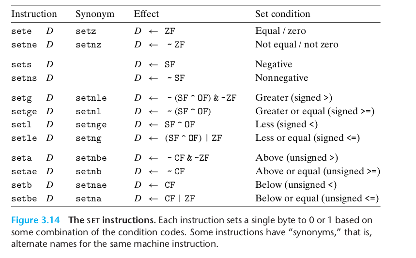
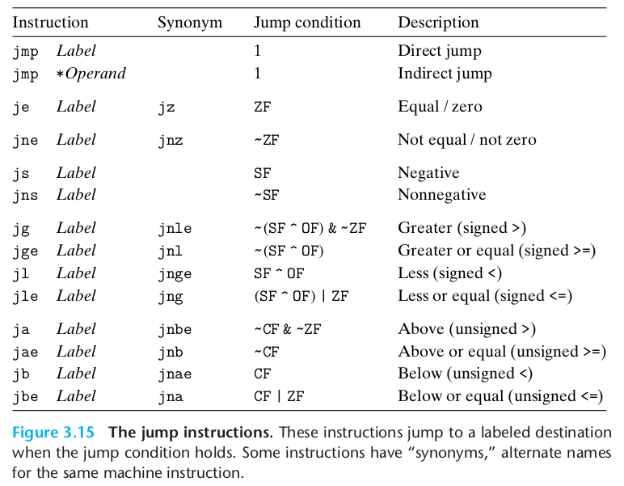
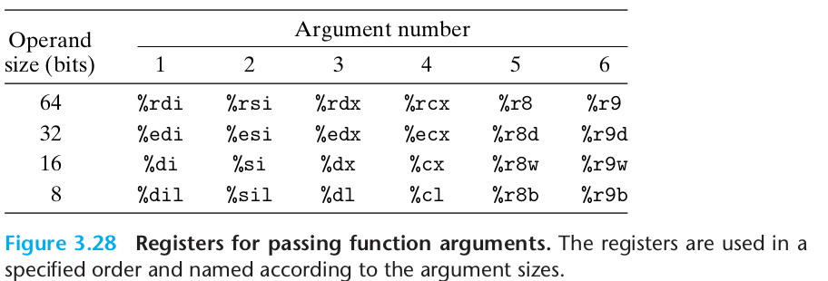

# Chap03

- [Chap03](#chap03)
  - [Contents](#contents)
    - [Notes](#notes)
      - [Registers](#registers)
      - [Operand Specifier](#operand-specifier)
      - [Move Instructions](#move-instructions)
        - [Pushing and Popping Stack Data](#pushing-and-popping-stack-data)
      - [Arithmetic and Logical Operations](#arithmetic-and-logical-operations)
        - [Load effective address](#load-effective-address)
        - [Unary and Binary Operations](#unary-and-binary-operations)
      - [Controll Structure](#controll-structure)
        - [Condition Code](#condition-code)
        - [Access to condition codes](#access-to-condition-codes)
        - [Jump](#jump)
        - [Conditional Move](#conditional-move)
        - [Loop](#loop)
        - [Switch](#switch)
      - [Procedures](#procedures)
        - [Runtime Stack](#runtime-stack)
        - [Controll Transfer](#controll-transfer)
        - [Data Transfer](#data-transfer)
        - [Local Storage on the stack](#local-storage-on-the-stack)
        - [Local Storage in the regs](#local-storage-in-the-regs)
        - [Recursive](#recursive)
      - [Array Allocation and access](#array-allocation-and-access)
        - [Rules](#rules)
        - [Operations](#operations)
      - [Struct and Union](#struct-and-union)
      - [Alignment](#alignment)
      - [Overflow](#overflow)
      - [Varible Size Array](#varible-size-array)
      - [Float](#float)
    - [Homework](#homework)
      - [3.58](#358)
      - [3.59](#359)
      - [3.60](#360)
      - [3.61](#361)
      - [3.62](#362)
      - [3.63](#363)
      - [3.64](#364)
      - [3.65](#365)
      - [3.66](#366)
      - [3.67](#367)
      - [3.68](#368)
      - [3.69](#369)
      - [3.70](#370)
      - [3.71](#371)

## Contents

This chapter builds around the assemble language, with a subset of x86-64 ISA, y86-64.

For the source code from CS:APP website are too old to build(wasted a lot of time..), I turn to online simulators. Here are the url: [y86.js.org](http://y86.js.org/), [boginw.github.io/js-y86-64/](https://boginw.github.io/js-y86-64/).

Before the homework, there will be some notes about the basic knowledge.

### Notes

#### Registers


#### Operand Specifier

Instruction set should have access to data stored in registers and memeory, and `Operand` is used to get them to a specific zone for possible use from some instructions.  

Immediate: `$Imm`, you will get the value Imm
Register: `%r`, here %r is a register's name, you will get data stored in `%r`
Memory: find data in memory 
1. `Imm`: data with value of Imm
2. `(%r)`: data at value in reg %r
3. `Imm(%r)`: data at (Imm + %r)
4. `(%ra, %rb)`: data at (%ra + %rb)
5. `Imm(%ra, %rb)`: data at (Imm + %ra + %rb)
6. `(, %r, s)`: data at (s*%r), where s is short for scale
7. `Imm(, %r, s)`: data at (s*%r + Imm)
8. `(%ra, %rb, s)`: data at (%ra + s*%rb)
9. `Imm(%ra, %rb, s)`: data at (Imm + %ra + s*%rb)


#### Move Instructions

`mov_ S D`: _ could be `b`, `w`, `l`, `q`  for different size. There are at least 1 reg in S, D.
`movabsq`
`movz__ S R`: Do zero extension and move.
`movs__ S R`: Do sign extension and move.

##### Pushing and Popping Stack Data
These operations are aiming at push and pop data into or from stack register `%rsp`.

`pushq S`: push a 64-bit data into **memory** at R[%rsp] and the R[%rsp] decreases by 8.
`popq D`: pop a 64-bit data from **memory** at R[%rsp] and the R[%rsp] increase by 8.
Note the stack is growing downward.

#### Arithmetic and Logical Operations

##### Load effective address
`leaq S D`: this take the address of S and store it in D.
`leaq` can be used in simple add operations, for example.
```asm
// x in %rdi y in %rsi
leaq    (%rdi, %rsi, 4), %rax
```
`(%rdi, %rsi, 4)` refers to the memory at (%rdi + 4 * %rsi), so in fact this make %rax store the (x + 4 * y)

##### Unary and Binary Operations
**Note**: instructions below are described in a single class with different operands and the end of them vary from 'b', 'w', 'l', 'q'

Unary operations' source is the same as it's destination.

`inc_ D`: D <- D+1
`dec_ D`: D <- D-1
`neg_ D`: D <- -D
`not_ D`: D <- ~D

Binary operations

`add_ S D`: D <- S + D
Generalized to `sub` `imul` `xor` `or` `and`

Shift operations

`sal_ k D`: D <- D << k (logic)
`shl_ k D`: D <- D << k (arithmeic)
`sar_ k D`: D <- D >> k (logic)
`shr_ k D`: D <- D >> k (arithmeic)

Multiply and divide of Oct word.
`imulq S`: (R[%rdx], R[%rax]) <- S * R[%rax] (signed)
`mulq S`: (R[%rdx], R[%rax]) <- S * R[%rax] (unsigned)

`clto`: (R[%rdx], R[%rax]) <- Signed Extend R[%rax]

`idivq S`: (R[%rdx], R[%rax]) <- S / R[%rax] (signed)
`divq S`: (R[%rdx], R[%rax]) <- S / R[%rax] (unsigned) 
R[%rdx] gets the mod, and R[%rax] gets the ans.

#### Controll Structure

##### Condition Code

`CF`: Carry Flag. To check if carry occurs in recent operation.
`ZF`: Zero Flag. The most recent operation yielded zero.
`SF`: Sign Flag. Negative value generated.
`OF`: Overflow Flag.

**Note**: Arithmetic operations will set flags while something like `;eaq` won't.

Some operations alert the flag registers only:
`cmp_ s1, s2`: check the value of (s2 - s1).

Let's have a look:
```c
case(s2-s1):
  == 0: ZF = 1; SF = 0;
  <0:   SF = 1; ZF = 0;
  >0:   SF = 0; ZF = 0;
```

`test_ s1, s2`: check the value of (s2 & s1).

##### Access to condition codes

Conditional Set: Only to the low-order byte.
`set_`
The suffix vary from the first character of equal, not equal, signed, not signed, greater, not greater...


##### Jump

With `jump` you can realize loop and switch and recursion.
`jmp .lable`: jump to a place named `.lable` unconditionally.
`jmp *%reg`: jump to certain memory
`jmp *(%reg)`: jump to some register

And jump in some condition:


##### Conditional Move
Move some data with conditional codes.

And in most cases, conditional move are better than conditional jump.

-[](img/cmov.png)

##### Loop

With jump and conditional codes, loop is easy to implement. 

##### Switch

First you compute the statement to be used, and then treat it as an index of `jmp`.

The index uses the concept of jump table.

```asm
  .section    .rodata
  .align      8
.L4:
  .quad       .L3
  .quad       .L5
  .quad       .L6
```

And you can the index in this way:

```
jmp   *.L4(, %rsi, 8)
```

#### Procedures

A procedure can be simply considered as a function. 
- Before the machine handle the function the PC gets the function's address. After calling, the PC gets the address after it.
- Functions may have some parameters and may return a value.
- Fuctions should be able to allocate and deallocate memory.

##### Runtime Stack

If the space in registers cannot meet the need of procedure, it will allocate some memory in stack, which is called stack fram.

If a procedure Q is called in a procedure P, the cpu will push the return address into stack to imply where P should continue.

##### Controll Transfer

If calling sth, the stack address will decrease by 8 or more. After that, resume the origin address.

##### Data Transfer

With specific registers, we can transfer data into procedure.



If too many parameters needed that registers are not enough, we need stack for para_7 to para_n. And para_7 is at stack top.


##### Local Storage on the stack

When the regs are not enough for paras, we need  stack to hold local varibles.

When you call it, it will allocate some space on the stack, and it will be freed after call.

##### Local Storage in the regs

The regs are the only to be shared to any procedure.

So what's the difference between `callee-saved` and `caller saved`?

`callee-saved` means that, if you call a procedure and you have to use some regs, you should save the origin value to stack and restore it after call.

`caller-saved` means you cannot ask the callee to do the job, you should do it yourself.

##### Recursive

It's almost the same with loop in asm. But recursive procedure will have a large stack usage.

#### Array Allocation and access

##### Rules

As we know data type has size varying from 8, 16, 32, 64, and the nature of an array is address and bias.

You can simply store the base address, the use the `(%reg1, %reg2, scale)` manner to access an element.

##### Operations

Apply `mov_` and `leaq` to get a pointer.
Apply `(%reg, %reg, scale)` to get a pointer de-reference.

Similiarly, if an array is made up of sub-arrays, the bias turns to be a bigger one.

Also, even if an array is indexed by a expression which always changes, the idea of bias still works. However, the index has to do with regs and multiplication which may cause more time consumption that before.

#### Struct and Union

Struct could be treated as a BIG int or char, because though it takes more space, pointer or address still works like before and the inside bias is controlled by complier.

Union's gramma is the same as struct, but the union has no inside struct. The space union take is what the largest one in the union takes. Union's pointer has no type check for it's mean to serve as a flexble type.

#### Alignment

The address of any data should be multiple of some value like 2, 4, 8 bytes. If a 64-bit or 8-byte double is stored in two elements of 8-byte, cpu will take 2 times to read or write it. So if a struct with size {4, 1, 4}, complier will allocate a {4, 1, 3, 4} to match the 4-byte align.

#### Overflow

C does not check the reference of a pointer, so if one pointer mistakenly gets into stack which should not be affected, a LOGIC EREOR will take place. 

#### Varible Size Array

Stack.

#### Float 

Like the integers' registers, float num also has a parted reg struct, which has 64bit and 32bit options. Besides, mov- structions are provided and the type transformation is a important part.

When we use float numbers, there is no immediate number for the bits of float is not like int's. 


### Homework

#### 3.58 

```c
long decode2(long x, long y, long z) {
  x = x * (y - z);
  long ret = y;
  if (y % 2) ret = ~x;
  else ret = x;
  return ret;
}
```

#### 3.59


```
store_prod:
movq  %rdx, %rax  
cqto              
// rdx, rax = (int128) y
movq  %rsi, %rcx
sarq  $63, %rcx
// rcx, rsi = (int128) x
imulq %rax, %rcx
// rcx = y_l * x_h
imulq %rsi, %rdx
// rdx = y_h * x_l
addq  %rdx, %rcx
// rcx = (x_l * y_h + x_h * y_l)_l
mulq  %rsi
// rdx = (x_l * y_l)_h
addq  %rcx, %rdx
// rdx = (x * y)_h
movq  %rax, (%rdi)
movq  %rdx, 8(%rdi)
// write to pointer
ret
```

#### 3.60

```
// long loop(long x, int n)
// x in %rdi, n in %esi
// rdx -> mask;
// r8 -> result
loop:
  movl  %esi, %ecx // ecx = n
  movl  $1, %edx   // edx = 1
  movl  $0, %eax   // eax = 0
  jmp .L2

.L3:  
  movq  %rdi, %r8 // r8 = x
  andq  %rdx, %r8 // r8 = x & rdx
  orq   %r8, %rax // rax = r8 | rax
  salq  %cl, %rdx // rdx <<= n & 0xff

.L2:
  testq %rdx, %rdx // test rdx
  jne .L3 // if rdx != 0, jump
  rep; ret

```
A: x : rdi; n : esi; result : r8; mask : rdx;
B: result = 0, mask = 1;
C: mask != 0
D: result = result & mask;
E:
```c
long loop(long x, int n) {
  long result = 0;
  long mask;
  for (mask = 0; mask != 0; mask = mask << (n & 0xff)) {
    result |= mask;
  }
  return result;
}
```

#### 3.61

```c
long cread_alt(long *xp) {
  return ((xp == NULL)? 0 : *xp);
}
```

#### 3.62

```
typedef enum {MODE_A, MODE_B, MODE_C, MODE_D, MODE_E} mode_t;

long switch3(long *p1, long *p2, mode_t action) 
{
  long result = 0;
  swtich (action) {
    case MODE_E:
      result = 27;
      break;
    case MODE_A:
      result = *p2;
      *p2 = *p1;
      break;
    case MODE_B:
      result = *p1 + *p2;
      *p1 = result;
      break;
    case MODE_C:
      *p1 = 59;
      result = *p2;
      break;
    case MODE_D:
      *p1 = *p2;
      result = 27 | ((int)(*p2));
    default:
      result = 12;
      break;

  }
  return result;
}
```

#### 3.63

I feel strange because ... some case has no break?

```c
long switch_prob(long x, long n) {
  long result = x;
  switch(n) { 
    case 0x3c:
      result = 8 * x;
      break;
    case 0x3d:
      result = x + 0x4b;
      break;
    case 0x3e:
      result = 8 * x;
      break;
    case 0x3f:
      result = x >> 3;
      break;
    case 0x40:
      result = x << 4;
      result -= x;
      x = result;
    case 0x41:
      x = x * x;
    default:
      result = x + 0x4b;
  }
}
```

#### 3.64

```c
A[i][j][k] = *(A + i * S * T + j * T + k)
```

```
ret = *(A + 8 * (65 * i0 + 13 * j0 + k0))
```

so T = 12, S = 3, R = 3640/S/T/8 = 7

#### 3.65

%rdx -> &(A[i][j])
%rax -> &(A[j][i])
M = 15

#### 3.66

NC(n) = 4 n + 1
NR(n) = 3 * n

#### 3.67

A: 

rsp1 = rsp0 - 104

rsp1      : x
rsp1 + 8  : y
rsp1 + 16 : (24 + rsp1)
rsp1 + 24 : z

B:

rdi       : rsp1 + 64

C: 

from the stack

D:

set value based on the rdi which is already pointing at a space in the stack.

E:

F:

stack pointer could serve as a base for sub-process.

#### 3.68

B = 2
A = 12

#### 3.69

typedef struct {
  long long idx;
  long x[3]
} a

CNT = 120 / 40 = 3

#### 3.70 

A. 0, 8, 0; 8;
B. 16
C. 
rax = *(up + 1) // y or *next
rdx = *(next)
rdx = *(next->p)
rdx = rdx - (*(up->next)).y

`up.x = *(up->next->p) - (*(up->next)).y`

#### 3.71

overflown buf will be read by next function which use the buf.


